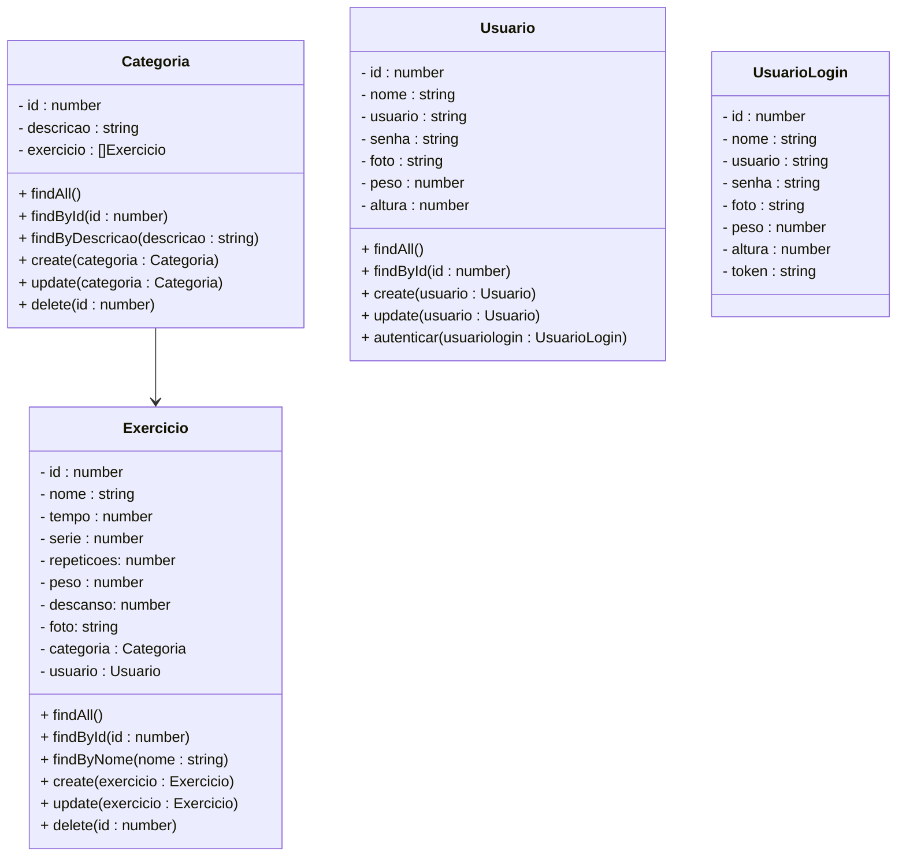

# Projeto Aplicativo Fitness

 

    

  

## 1. Descrição

Um aplicativo fitness é uma plataforma digital que auxilia os usuários na prática de atividades físicas e na gestão de sua saúde. Com funções como monitoramento de exercícios, registro de alimentação, acompanhamento de objetivos e suporte para um estilo de vida mais ativo, os aplicativos fitness são projetados para facilitar a prática de atividades físicas e promover hábitos saudáveis.

### 1.1. Principais Funcionalidades

1. Monitoramento de Exercícios
   
2. Rastreamento de Saúde
   
3. Cálculo do IMC e Monitoramento de Peso
   
4. Planos de Treino e Exercícios Personalizados
   
5. Controle de Alimentação
   
6. Gamificação e Desafios diários
   
7. Integração com Comunidades e Redes Sociais

Os aplicativos fitness são uma solução versátil para qualquer nível de usuário, oferecendo flexibilidade para acompanhar e ajustar a prática de exercícios e a alimentação de forma prática e interativa.

------

## 2. Sobre esta API

Esta API foi desenvolvida utilizando NestJS para criar a estrutura  básica de um sistema de caronas compartilhadas. Ela fornece endpoints  para gerenciar usuários, categorias e exercícios, além de calcular o IMC (Índice de Massa Corporal), com base no peso e altura do usuário.

Esta API é um Mínimo Produto Viável (MVP) de um aplicativo Fitness.

### 2.1. Principais Funcionalidades

1. Cadastro e gerenciamento de usuários
2. Registro e gerenciamento de categorias
3. Criação e gerenciamento de exercícios
4. Cálculo do IMC (Índice de Massa Corporal)

### 2.2. Cálculo do IMC

O IMC, ou Índice de Massa Corporal, é uma medida usada para avaliar se uma pessoa está dentro de uma faixa de peso saudável em relação à sua altura. É calculado dividindo-se o peso (em quilogramas) pela altura (em metros) elevada ao quadrado. A fórmula é:
$$
IMC= \frac{\text{peso (kg)}}{\text{altura (m)}^2}
$$
O resultado é classificado em categorias, que indicam se a pessoa está abaixo do peso, com peso normal, sobrepeso ou obesidade, como mostra a tabela abaixo:

| IMC               | Classificação       | Descrição                                                    |
| ----------------- | ------------------- | ------------------------------------------------------------ |
| Acima de 40,0     | Obesidade  grau III | Aqui o sinal é vermelho, com forte probabilidade de já  existirem doenças muito graves associadas. O tratamento deve ser ainda  mais urgente. |
| Entre 35,0 e 39,9 | Obesidade  grau II  | Mesmo que seus exames aparentem estar normais, é hora de se cuidar,  iniciando mudanças no estilo de vida com o acompanhamento próximo de  profissionais de saúde. |
| Entre 30,0 e 34,9 | Obesidade  grau I   | Sinal de alerta! Chegou na hora de se cuidar, mesmo que seus exames  sejam normais. Vamos dar início a mudanças hoje! Cuide de sua  alimentação. Você precisa iniciar um acompanhamento com nutricionista  e/ou endocrinologista. |
| Entre 25,0 e 29,9 | Sobrepeso           | Ele é, na verdade, uma pré-obesidade e muitas pessoas nessa faixa já  apresentam doenças associadas, como diabetes e hipertensão. Importante  rever hábitos e buscar ajuda antes de, por uma série de fatores, entrar  na faixa da obesidade pra valer. |
| Entre 18,6 e 24,9 | Normal              | Que bom que você está com o peso normal! E o melhor jeito de continuar  assim é mantendo um estilo de vida ativo e uma alimentação equilibrada. |
| 18,5 ou menos     | Abaixo do normal    | Procure um médico. Algumas pessoas têm um baixo peso por características do seu organismo e tudo bem. Outras podem estar enfrentando problemas, como a  desnutrição. É preciso saber qual é o caso. |

------

## 3. Diagrama de Classes

**Observações Importantes:**

- O peso do usuário será expresso em Quilogramas (Kg)
- A Altura do usuário será expressa em Metros (m)
- O peso utilizado pelo usuário no exercício será expresso em Quilogramas (Kg)
- O tempo de execução do exercício será expresso em Minutos (m)
- O numero de Séries e Repetições serão expressos em números inteiros positivos

------

## 4. Diagrama Entidade-Relacionamento (DER)

    

------

## 5. Tecnologias utilizadas

| Item                          | Descrição  |
| ----------------------------- | ---------- |
| **Servidor**                  | Node JS    |
| **Linguagem de programação**  | TypeScript |
| **Framework**                 | Nest JS    |
| **ORM**                       | TypeORM    |
| **Banco de dados Relacional** | MySQL      |

------

## 6. Configuração e Execução

1. Clone o repositório
2. Instale as dependências: `npm install`
3. Configure o banco de dados no arquivo `app.module.ts`
4. Execute a aplicação: `npm run start:dev`

